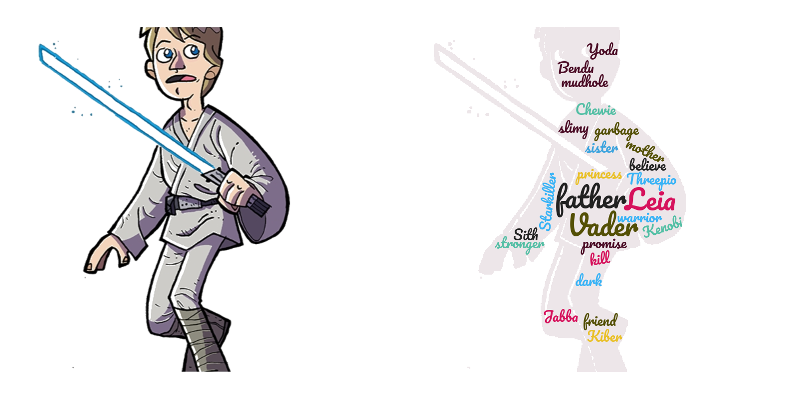

# Chat-with-Skywalker


Skywalker Chatbot for *Natural Language Processing* 2019 Fall @ Fudan University, by  [**Zuobai Zhang**](<https://oxer11.github.io/>)

## What's this


**In fact, I think this project is a failure.**

## How to use

### Prerequisites

```
Python 3.7
Pytorch 1.0.1
```

### Usage

To train the model, you should first go into the /code/ repository and then run this command.

```bash
python main.py -tr ./data/Dailydialog.txt -la 2 -hi 256 -lr 0.0001 -it 20000 -b 64 -p 500 -s 1000
```

To chat with Luke Skywalker, you can first type this command and get the basic reply. Then, you should select the sentence with highest BLEU score in Luke Corpus as the final reply. (This step is in some sense unreasonable.)

```bash
python main.py -te ./save/model/Dailydialog/2-2_256/20000_backup_bidir_model.tar -c ./data/crosstalk_peng -i
```

## Examples

```
Me： What are you doing?
Chatbot： I'm looking for my key.
Luke： I'm looking for a great warrior.
Me： What's your problem? 
Chatbot： I'm going to Rockefeller Center. Thanks for asking.
Luke： They're a lot stronger than I'm used to. 
Me： Where is he?
Chatbot： He's on that aircraft.
Luke： Vader's on that ship.
```
